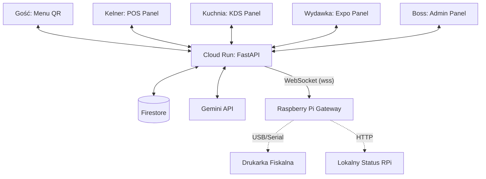

# Elvis POS — Schemat Architektury

## Architektura Wysokiego Poziomu

## Komponenty Systemu

### 1. Cloud Backend (FastAPI)
- **Host**: Google Cloud Run.
- **Funkcja**: Centralny hub danych, obsługa autoryzacji Google/PIN, zarządzanie stanem koszyka i zamówień.
- **Real-time**: WebSocket Manager rozsyłający aktualizacje (`update`, `receipt`, `call_waiter`).

### 2. Edge Gateway (RPi App)
- **Host**: Raspberry Pi.
- **Zadanie**: Most między chmurą a sprzętem fizycznym.
- **Bezpieczeństwo**: Blokada dostępu z sieci lokalnej (tylko localhost lub autoryzowany PIN).
- **Fallback**: Logowanie zdarzeń lokalnie w razie braku internetu.

### 3. Frontend (Vanilla JS + Templates)
- **Styl**: Dark premium (Glassmorphism), responsywny (Mobile-first).
- **Auth**:
    - Master/Admin: Google OAuth.
    - Pracownicy: PIN-based (Staff Collection).
    - Klienci: Session-based (Anonymous).

### 4. Baza Danych (Firestore)
- **Menu**: Struktura produktów i kategorii.
- **Orders**: Kolekcja zamówień z historią statusów.
- **Active Tables**: Stan stolików w czasie rzeczywistym.
- **Devices**: Rejestracja i telemetria terminali RPi.
